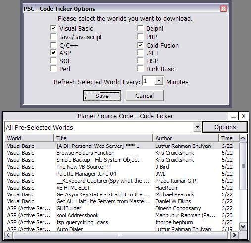

## Advanced PSC Code Ticker

### Description

I have always wanted to do this. I wanted a way to format the code ticker myself in VB so I can do whatever with it. So this doesn't use the IE control it downloads the ASP page from the internet saves it to the HD and then parses it for code samples. I haven't seen anything on here that does the ticker like this hense the "Advanced" title. If I get good feedback I will most likely add features like: Alerts (This would make it possible to be notified with certain authors post code or even to notify when new code is posted) this can be done by a form that shows up and goes away after a bit.

I think it is endless. I did notice that with the ASP page it is executed at the server so I get the HTML back and I am guessing that the ticker SQL code just grabs the top 9 code submissions. Of course I don't have the ability to query the DB so this is the best I could think of. Well please remember to vote and I hope you friendly PCS'ers think this is a good idea. Please comment. Have a great day.
 
### More Info
 

             |
---                |---
**Submitted On**   |2004-06-22 11:33:42
**By**             |[Sentax](https://github.com/Planet-Source-Code/PSCIndex/blob/master/ByAuthor/sentax.md)
**Level**          |Advanced
**User Rating**    |4.9 (39 globes from 8 users)
**Compatibility**  |VB 6\.0
**Category**       |[Internet/ HTML](https://github.com/Planet-Source-Code/PSCIndex/blob/master/ByCategory/internet-html__1-34.md)
**World**          |[Visual Basic](https://github.com/Planet-Source-Code/PSCIndex/blob/master/ByWorld/visual-basic.md)
**Archive File**   |[Advances\_P1760716222004\.zip](https://github.com/Planet-Source-Code/sentax-advanced-psc-code-ticker__1-54545/archive/master.zip)

